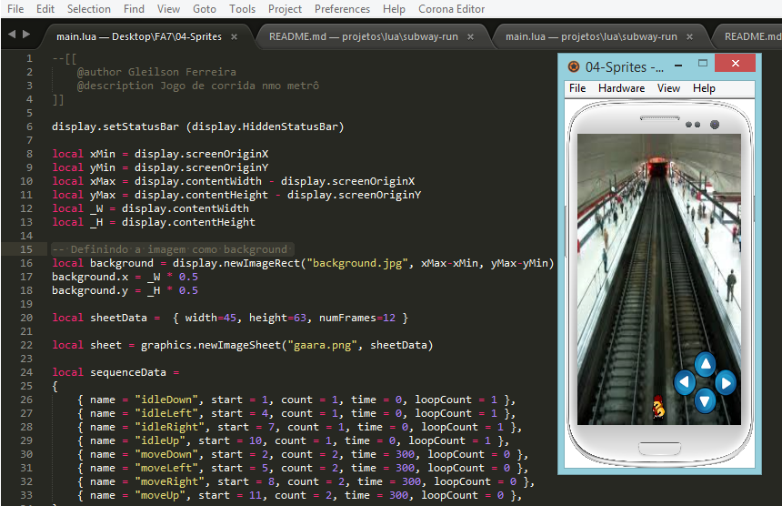

# Subway Run
Desenvolvido para Trabalho de Estágio 1 - FA7

## Sumário

* [Enredo](#enredo)
* [Objetivo Geral](#objetivo-geral)
* [Objetivos Específicos](#objetivos-específicos)
* [Tecnologias Utilizadas](#tecnologias-utilizadas)

# Enredo
Subway Run é um jogo móvel de uma corrida interminável. Onde o personagem Gaara tem que correr pelos metrôs das cidades coletando itens e desviando dos obstáculos. Esses itens serviram para aumentar a pontuação do jogador quando ele perder na fase. Além de poder liberar novos itens para personalizar seu personagem. Ultrapasse seus próprios recordes e fique em primeiro lugar no ranking de pontuação contra seus amigos.

# Objetivo Geral

* Conseguir o maior número de pontos para ficar em primeiro lugar no ranking

# Objetivos Específicos

* Desviar dos obstáculos
* Coleta os itens que aparecem em cada nível do jogo
* Ultrapassar os próprios recordes
* Ultrapassar as pontuações dos seus amigos
* Personalizar seu personagem 

# Tecnologias Utilizadas

* Lua
* Corona SDK